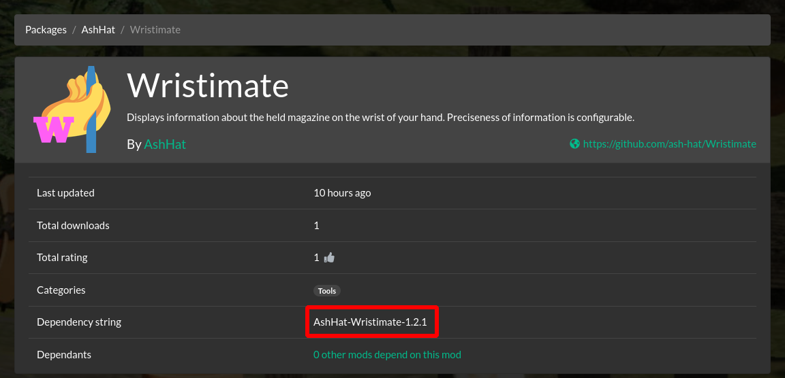

# Putting Deli 0.3 Mods on Thunderstore and r2modman
A short, step-by-step guide on how to properly package Deli 0.3 mods to be uploaded to [Thunderstore](https://h3vr.thunderstore.io/) and consumed by [r2modmanPlus](https://github.com/ebkr/r2modmanPlus) (hereafter r2modman).

# File Structure
File structure required for Deli 0.3 mods is simple. You can place the files in whatever folders you please, but the easiest is:

```
MyAuthor-MyMod.zip/
  icon.png
  manifest.json
  MyMod.deli
  README.md
```

Directory mods still exist, but using them requires a more complicated file structure:
```
MyAuthor-MyMod.zip/
  files/
    plugins/
      manifest.json
      ...
  icon.png
  manifest.json
  README.md
```

I personally recommend sticking with `.deli` files still, unless the loader you use has optimizations ready for files on disk.

## `manifest.json`
Depending on your purpose, you need to choose between 2 different manifests. I recommend starting with ManifestV2, and rewriting to ManifestV1 before uploading.

### ManifestV2 (local testing)
ManifestV2 is a WIP manifest format. While it cannot be used on Thunderstore, r2modman refuses to install ManifestV1 zips from sources other than Thunderstore. Most of your users will be using r2modman, so you should ensure that your mod installs properly on r2modman before uploading it to Thunderstore. For this reason, you use a ManifestV2.

Use this template:
```json
{
    "ManifestVersion": 2,
    "AuthorName": "ChangeMe",
    "Name": "ChangeMeAuthor-ChangeMeName",
    "DisplayName": "ChangeMe",
    "Version": "ChangeMe",
    "Licence": "",
    "WebsiteURL": "",
    "Description": "",
    "GameVersion": "N/A",
    "Dependencies": [],
    "OptionalDependencies": [
        "DeliCollective-Deli-0.4.1"
    ],
    "Incompatibilities": [],
    "NetworkMode": "both",
    "PackageType": "mod",
    "InstallMode": "managed",
    "Loaders": [
        "bepinex"
    ],
    "ExtraData": {}
}
```

### ManifestV1 (Thunderstore listing)
When you are ready to create a release for Thunderstore, this is the format you need.

Use this template:
```json
{
    "name": "ChangeMe",
    "version_number": "ChangeMeSemverOnly",
    "website_url": "ChangeMe",
    "description": "ChangeMe250CharactersMax",
    "dependencies": [
        "DeliCollective-Deli-0.4.1"
    ]
}
```

If you do not have a website URL, simply leave it blank.  
If you already have a ManifestV2, just copy the properties from it. The ManifestV1 `name` is *purely* the name, not including the author like ManifestV2 does.

### Either
There are some things to consider, regardless of the manifest version you're using:

1. The mod name can only contain `a-z`, `A-Z`, `0-9`, and `_` (this gets rendered as a space in Thunderstore and r2modman). On ManifestV2, there is a hyphen to delimit author and mod name, but the mod name itself still follows these rules.

2. If your Deli mod depends on other Deli mods (e.g. TakeAndHoldTweaker, WurstMod), you must add their "dependency string" to your dependencies. You can find the string by going to the mod's Thunderstore webpage, and looking at the info near the top:  
  
Add the string to the `dependencies` array, like Deli in the manifest template.

## `README.md`
Your Thunderstore `README.md` is like your BoneTome description. Unlike BoneTome descriptions though, Thunderstore READMEs support Markdown! If you are not familiar with Markdown, it's like an easy markup language that gives your text some flavor. You can use [GitHub's guide](https://guides.github.com/features/mastering-markdown) to learn the ins and outs, but do not use GitHub Flavored Markdown (GFM) features.

If you already had a README file, make sure you remove any old installation instructions. It's confusing to users if you keep them in.

## `icon.png`
The icon must simply be 256x256, and it can (but does not need to) have transparency. If you do not have an icon, and easy fix is to use white text with your project name over a transparent background.

# Final Checklist
Ensure all of the following *before* uploading your mod to Thunderstore:

## First Release
- Your `.deli` file is up to date
- Your manifest
  - has accurate information
  - contains all the dependencies required
  - does not have a typo in the name
- Your readme
  - does not have old installation instructions
  - has accurate information
- Your icon
  - is 256x256
  - is transparent (if desired)

## Updates
- Your `.deli` file is up to date
- Your manifest
  - has a newer `version_number`

Do not be worried if you upload a manifest of the wrong format, because it will spit out an error.  
In the case that it successfully uploads but you messed up badly, you can contact a Thunderstore moderator to remove it. However, this should happen rarely.

# Examples
I've included examples of 2 of my code mods in [the examples directory](examples/), unzipped for your viewing pleasure. As you can see, nothing is different between the normal and ManifestV2 versions, except one uses ManifestV2.

# Sources
- [The ror2modman wiki](https://github.com/ebkr/r2modmanPlus/wiki/)
  - [Structuring your Thunderstore package](https://github.com/ebkr/r2modmanPlus/wiki/Structuring-your-Thunderstore-package)
  - [What does a ManifestV2 look like](https://github.com/ebkr/r2modmanPlus/wiki/Installing-mods-locally#what-does-a-manifestv2-look-like).
- [The Thunderstore upload page](https://h3vr.thunderstore.io/package/create/)